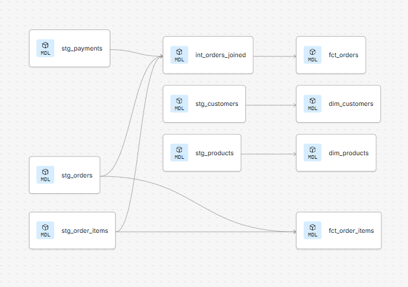
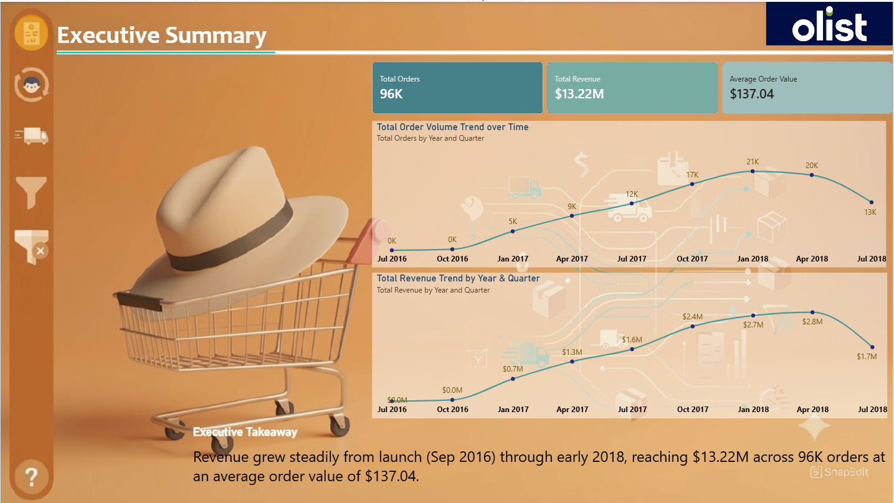
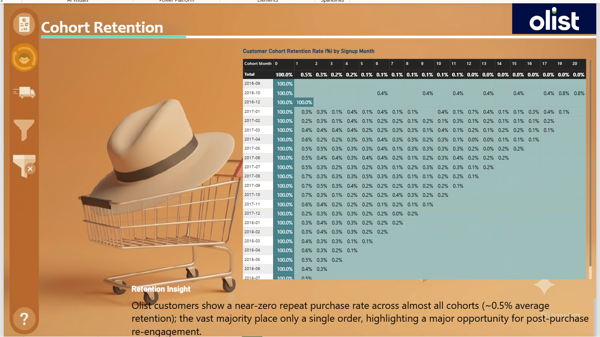
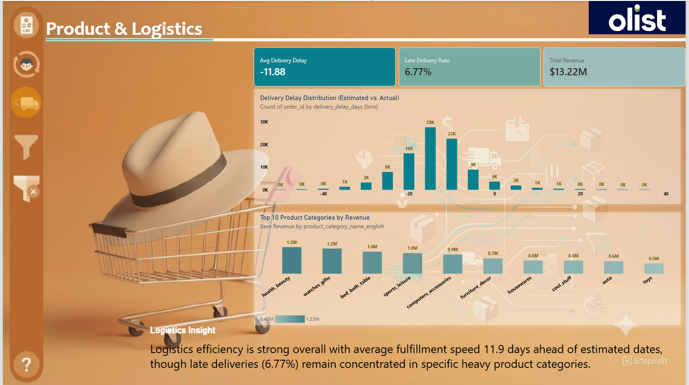

# ☁️ Modern Cloud Data Stack — BigQuery + dbt + Power BI

> An end-to-end analytics engineering pipeline built on the Brazilian E-Commerce (Olist) dataset — raw data in BigQuery, transformed through a 3-tier dbt model with automated tests and lineage, visualized in an interactive Power BI dashboard.

[]()
[]()
[]()
[]()

---

## 🎯 Project Objective

Most portfolio SQL projects stop at writing queries. This project demonstrates the full analytics engineering workflow a data team actually uses in production:

- Ingest raw e-commerce data into a cloud data warehouse (BigQuery)
- Build a modular, tested, documented transformation layer with dbt (staging → intermediate → marts)
- Serve clean, business-ready tables to a BI tool (Power BI) for interactive reporting

---

## 📊 Dataset

| Property | Detail |
|---|---|
| Source | Kaggle — Brazilian E-Commerce Public Dataset by Olist |
| Tables | 9 raw tables: orders, order_items, payments, reviews, customers, products, sellers, geolocation, category_translation |
| Scale | ~99K orders, ~112K order items, ~99K customers |
| Warehouse | Google BigQuery (Sandbox, free tier) |

**Known dataset characteristic:** `customer_id` is unique **per order**, not per person — `customer_unique_id` is the actual repeat-customer identifier. This distinction matters for cohort/retention analysis (see below) and is a common gotcha with this dataset.

---

## 🔄 Pipeline Architecture

```
BigQuery raw tables (9)
    → Staging (5 models: cleaned, typed, standardized)
    → Intermediate (int_orders_joined: joins + aggregates order-level data)
    → Marts (dim_customers, dim_products, fct_orders, fct_order_items)
    → Power BI (live BigQuery connection, 3-tab dashboard)
```

### dbt Lineage Graph



---

## 🧱 3-Tier dbt Model

### Staging (`models/staging/`)
5 models — one per raw source table (`stg_orders`, `stg_order_items`, `stg_payments`, `stg_customers`, `stg_products`). Each: casts data types explicitly, standardizes column names, no business logic.

### Intermediate (`models/intermediate/`)
`int_orders_joined` — aggregates `order_items` and `payments` to one row per order, joins onto `orders`. This is where multi-table join complexity lives, kept separate from both staging (too early) and marts (too late/business-facing).

### Marts (`models/marts/`)
| Model | Grain | Purpose |
|---|---|---|
| `dim_customers` | 1 row per customer | Customer dimension |
| `dim_products` | 1 row per product | Product dimension, joined to English category names |
| `fct_orders` | 1 row per delivered order | Order-level fact table with delivery delay metric |
| `fct_order_items` | 1 row per order item | Item-level fact table (added to support product-level reporting) |

**Materialization strategy:** staging/intermediate = views (lightweight, always fresh); marts = tables (materialized, faster for BI queries).

---

## 🧪 Automated Data Quality Tests

Defined in `models/marts/schema.yml`:

| Test | Applied To |
|---|---|
| `unique` + `not_null` | Primary keys: `customer_id`, `product_id`, `order_id` |
| `relationships` | Referential integrity: `fct_orders.customer_id` → `dim_customers`, `fct_order_items.product_id` → `dim_products`, `fct_order_items.order_id` → `fct_orders` |
| `accepted_values` | `order_status` restricted to `'delivered'` |

All tests passing (`dbt test` — 0 errors).

---

## 📊 Power BI Dashboard (3 tabs)

**Connection:** Live BigQuery connection (Import mode) via Power BI's native Google BigQuery connector.
**Interactivity:** Two synced slicers (Order Purchase Date range, Product Category) apply across all three pages.

### Tab 1 — Executive Summary



- KPI cards: Total Orders (96K), Total Revenue ($13.22M), Average Order Value ($137.04)
- Order volume and revenue trend by year & quarter (2016–2018)
- **Takeaway:** Revenue grew steadily from launch (Sep 2016) through early 2018, reaching $13.22M across 96K orders at an average order value of $137.04.

### Tab 2 — Customer Cohort Retention



- Cohort matrix: customers grouped by first-purchase month (using `customer_unique_id`), retention tracked across subsequent months
- **Retention Insight:** Olist customers show a near-zero repeat-purchase rate across almost all cohorts (~0.5% average retention beyond Month 0); the vast majority place only a single order. This reflects Olist's real-world buyer behavior and highlights a major opportunity for post-purchase re-engagement (email retention flows, loyalty rewards).

### Tab 3 — Product & Logistics Performance



- Top 10 product categories by revenue (health_beauty, watches_gifts, bed_bath_table leading)
- Delivery delay distribution (estimated vs. actual, histogram)
- **Logistics Insight:** Logistics efficiency is strong overall, with average fulfillment speed 11.9 days ahead of estimated dates — though late deliveries (6.77%) remain concentrated in specific heavy product categories.

---

## 🗂️ Project Structure

```
cloud-data-stack-dbt-bigquery/
├── models/
│   ├── staging/
│   │   ├── stg_orders.sql
│   │   ├── stg_order_items.sql
│   │   ├── stg_payments.sql
│   │   ├── stg_customers.sql
│   │   └── stg_products.sql
│   ├── intermediate/
│   │   └── int_orders_joined.sql
│   └── marts/
│       ├── dim_customers.sql
│       ├── dim_products.sql
│       ├── fct_orders.sql
│       ├── fct_order_items.sql
│       └── schema.yml
├── powerbi/
│   └── olist_ecommerce_dashboard.pbix
├── docs/
│   ├── lineage_graph.png
│   └── dashboard/
│       ├── olist_ecommerce_dashboard_page1.png
│       ├── olist_ecommerce_dashboard_page2.png
│       └── olist_ecommerce_dashboard_page3.png
├── dbt_project.yml
└── README.md
```

---

## 🛠️ Tech Stack

| Tool | Purpose |
|---|---|
| Google BigQuery | Cloud data warehouse (Sandbox, free tier) |
| dbt Cloud | Transformation, testing, documentation, lineage |
| Power BI | Live BigQuery connection, interactive 3-tab dashboard |
| Kaggle | Dataset source |

---

## 🚀 How to Reproduce

**1. Load raw data into BigQuery**
Download the Olist dataset from Kaggle, upload each CSV as a table into an `olist_raw` dataset in BigQuery (schema auto-detect works for most files; `category_translation` requires manual schema + header-row skip due to a known auto-detect issue on 2-column files).

**2. Run the dbt project**
```
dbt run    # builds all staging, intermediate, and marts models
dbt test   # runs all data quality tests
```

**3. Connect Power BI**
Get Data → Google BigQuery → enter Project ID → Navigator → select `dim_customers`, `dim_products`, `fct_orders`, `fct_order_items` from the dbt output dataset → Import.

---

## 📬 Contact

- **GitHub:** [Navaneeth1707](https://github.com/Navaneeth1707)
- **LinkedIn:** [Navaneeth M](https://www.linkedin.com/in/navaneethm1707)
